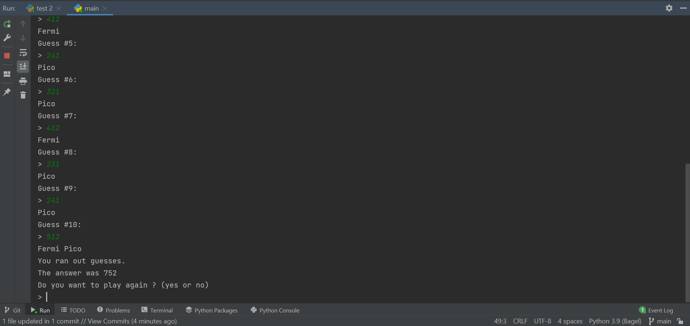

# Bagel

## How to play
The game is to guess the correct three digit number. When playing you must type the three number in. If the number is correct and is in the correct spot then it will `Fermi` but if the number is correct but the spot is not then it will say `Pico`. Though if all is wrong then it will say `Bagel`. You have a total of ten guesses.
## How to use
1. Go to your terminal
2. Use `python main.py` to run the code

